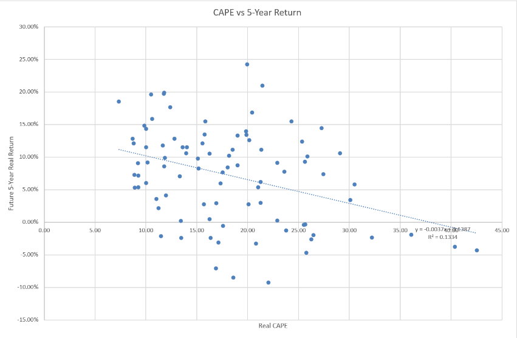

## Results

### CAPE vs 5-Year Forward Return

# CAPE-Based Asset Allocation Strategy

## Overview

This project develops and backtests a dynamic asset allocation strategy using the Shiller CAPE ratio and 103 years of historical S&P Composite market data (1922–2024). The strategy dynamically adjusts portfolio allocations between equities and Treasury bills based on market valuation and compares its performance against a traditional 60/40 benchmark.

---

## Objectives

- Evaluate CAPE's predictive power for future equity returns.
- Develop a valuation-based dynamic asset allocation strategy.
- Compare strategy performance with a traditional 60/40 portfolio.

---

## Methodology

- Constructed the real CAPE ratio using inflation-adjusted earnings.
- Performed OLS regression on both 1-year and 5-year forward returns.
- Developed a three-tier valuation-based asset allocation strategy.
- Backtested the strategy from 1933–2024 against a static 60/40 benchmark.

---

# Results

### CAPE vs. 5-Year Forward Return

Higher CAPE ratios are associated with lower subsequent 5-year returns, supporting the use of valuation-based asset allocation.

---

### Allocation Rule

| Real CAPE Range | S&P 500 | Treasury Bills |
|-----------------|---------|----------------|
| Below 15 (Undervalued) | 80% | 20% |
| 15–25 (Fair Value) | 60% | 40% |
| Above 25 (Overvalued) | 30% | 70% |

---

### Portfolio Growth

Applying the allocation strategy from 1933–2024 produced higher cumulative wealth than a traditional 60/40 benchmark.

---

### Performance Metrics

| Metric | CAPE Strategy | 60/40 Benchmark |
|---------|--------------:|----------------:|
| CAGR | **9.14%** | 8.56% |
| Annualized Volatility | 11.61% | 10.56% |
| Sharpe Ratio | 0.84 | **0.86** |
| Maximum Drawdown | **-21.4%** | -22.0% |
| Growth of $1 | **$3,130** | $1,918 |

---

## Key Findings

- CAPE exhibits significantly stronger predictive power over **5-year** horizons than **1-year** horizons.
- The dynamic CAPE strategy achieved a higher **compound annual growth rate (9.14% vs. 8.56%)**.
- A hypothetical **$1 investment grew to approximately $3,130**, compared with **$1,918** under the traditional 60/40 benchmark.
- The strategy reduced maximum drawdown slightly while maintaining comparable risk-adjusted performance.

---

## Project Files

- 📄 Investment Research Report (PDF)
- 📊 Excel Financial Model (PDF)

---

## Tools

- Microsoft Excel
- Financial Modeling
- Regression Analysis
- Investment Research
